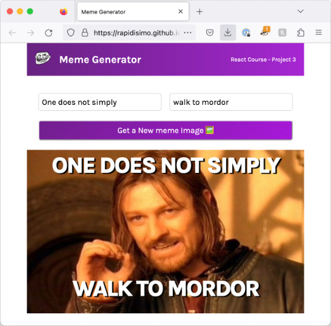

# Scrimba React Basics Project

### [Live Version](https://rapidisimo.github.io/meme-generator/)

## My Objectives
Understand the lessons and produce the same work outside of the Scrimba editor in my local VSCode enviroment.

## Requirements
1. Solve the challenges on my own and produce a faux meme generator.

### Learning
Some of the things I learned to use in React:
- Event Listeners
- State
- Conditional Rendering
- Forms
- Side Effects

## Preview

